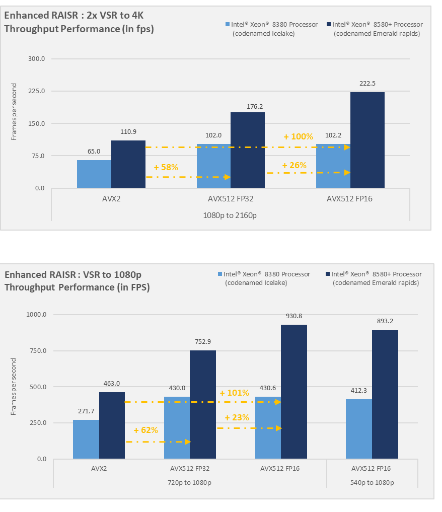
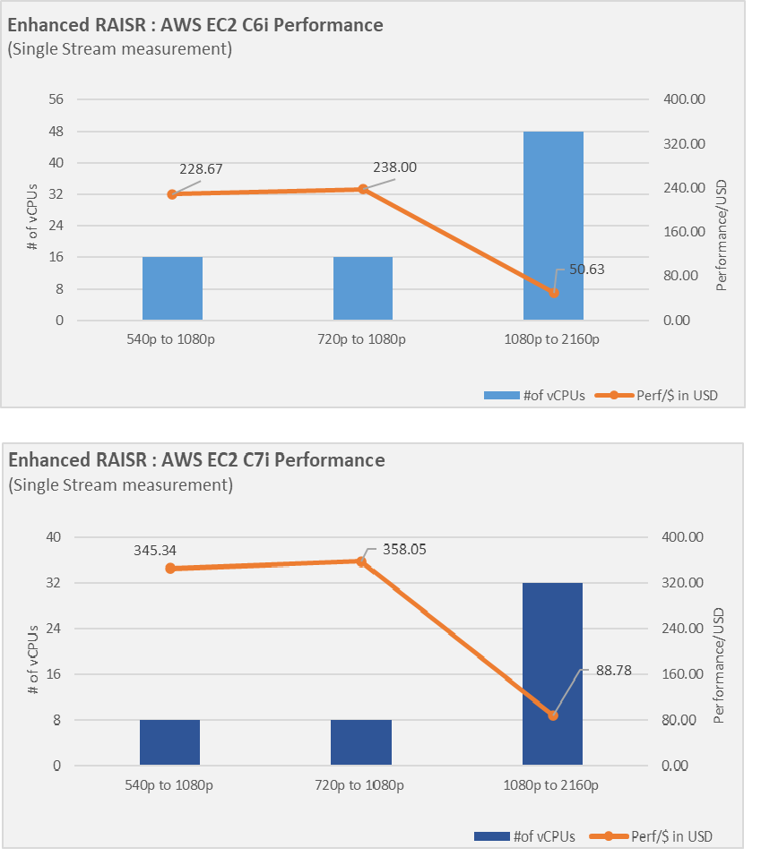
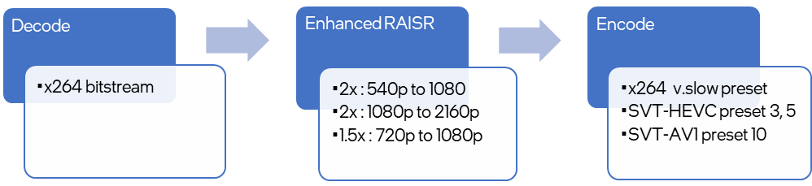
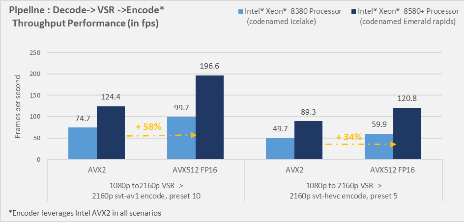
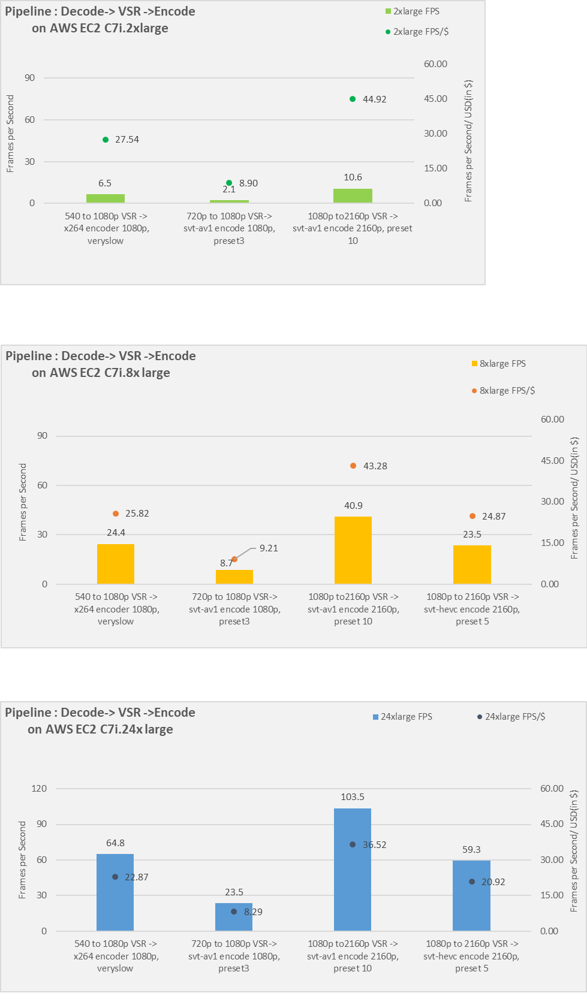

## Performance

Enhanced RAISR is an optimized video super-resolution model trained to upscale video streams, originally captured or transcoded to lower resolution. The model is seamlessly integrated into the video transcoding workflows through high-level APIs like FFMPEG for multimedia applications for video delivery like Video on Demand (VOD), Broadcast, Streaming, etc. The model's performance is assessed with and without video transcoding using FFMPEG plugins, facilitating various deployment options. For more details, refer to the performance command and measuring methodology. 
The model is supported on Intel® Xeon® Scalable Processor and Intel Data Center GPUs. Here, we are focusing on performance on the Xeon Scalable platform supporting real-time and offline usage scenarios without the need to offload to an external accelerator. The model can leverage Instruction Set Architecture (ISA) like Intel® Advanced Vector Extensions 2.0 (Intel® AVX2) and Intel® Advanced Vector Extensions 512 (Intel® AVX-512) to meet different workloads and system environments. Intel AVX2 and AVX512 have been supported since 1st generation Intel Xeon Scalable Processor supporting 32-bit and 64-bit floating-point instructions. Additionally, the 4th generation Intel Xeon Scalable processor introduces support for the new 16-bit half-precision IEEE-754 floating-point ISA for Intel AVX512, providing native hardware support. 
With Intel AVX512, model performance (in frames per second compared) can improve by 100% compared to Intel AVX2 ISA, where FP16 native support contributes 25% of the improvement. The model consists of several different filters including high res, low res, and noise for specific needs, as they are of the same complexity, they measure similar frames per second and improvements with ISAs. The two-pass filter doubles the compute requirement; hence the performance is reduced to half of a single-pass filter. 

Baremetal Testing of Enhanced RAISR
The model is measured for the throughput performance on an Intel Xeon Processor in the baremetal environment for offline, batch processing in VOD applications. Performance is measured by executing multiple streams, each pinned to a corresponding pair of logical cores of socket 0, with the total number of streams equivalent to the number of physical cores within socket 0. For example, on the Intel Xeon 8380 processor, 40 streams run in parallel to maximize the cpu utilization for throughput performance. The stream is also looped x number of times to obtain stable results.  

Example command line :
```
ffmpeg -stream_loop <x> -i /test_video/Netflix_Boat_1920x1080_60fps_10b.y4m -vf raisr=threadcount=2:bits=10:asm=avx2:passes=1:filterfolder=filters_2x/filters_highres -f NULL -
```
 

 


## AWS Cloud Performance on EC2 Instance   
The cloud testing of Enhanced RAISR involves measuring the performance of the model on EC2 C6i and C7i instances, mapped to Intel Xeon 3rd generation and 4th generation platforms. The public cloud benchmarking focuses on real-time, live-streaming, latency-sensitive applications, where single-stream performance is measured by running the model on a specific number of vCPU to calculate the minimum instance needed to reach the 60 frames per second and the performance per dollar. 




 
The results indicate the number of vCPUs necessary to process Enhanced RAISR at 60 frames per second or above on the Intel Xeon processor deployed in AWS EC2 instances. For 2x upscaling to UHD 3840x2160p, the number of vCPUs required is 32 vCPU , corresponding to  8xlarge instance type, or 48vCPUs corresponding to 12x large instance type depending upon processor generation. For upscaling to Full HD 1920x1080p, the algorithm requires as few as 8 VCPUs mapping to 2x large for content originally in HD and SD resolution. 
When comparing EC2 C7 instances to the previous generation C6 instances, the overall performance per dollar improves by 50-75% due to the hardware and software optimizations available in the latest generation of Intel Xeon Scalable Processor. 


## Advanced Usage: 
While Enhanced RAISR can be processed independently for VOD applications, it is coupled with video encoders for broadcast and live streaming. We have selected various widely used codecs with different encoding parameters to demonstrate performance viability on Intel Xeon Platforms. The pipeline illustrates the integration of functional blocks of decoding the incoming bitstream to YUV format, submitting to enhanced RAISR for an upscaling to higher resolution, and finally, encoding the YUV to compressed bitstream. The pipeline is configured to process enhanced RAISR leveraging Intel AVX2 or Intel AVX512 while consistently leveraging AVX2 instructions for encoding to assess the performance benefits of model improvements in this workflow. 

 

The workflow is measured for the throughput performance on the Intel Xeon processor in the baremetal environment and AWS cloud for offline processing. Performance is measured by executing multiple video streams simultaneously, let’s say N, where the value of N is determined by the total number of available physical cpu cores divided by 8. Each stream is allocated 8 cores , shared between the upscaling and transcoding. Additionally, the process is also looped a few number of times for stable results. 

Sample command line below: 
```
ffmpeg -stream_loop <x> -i /test_video/Netflix_Boat_1920x1080_60fps_10bit_420.mp4 -vf raisr=threadcount=<y>:bits=10:asm=avx512fp16:passes=1:filterfolder=filters_2x/filters_highres -c:v libsvt_hevc -preset 5 -profile:v 2 -rc 1 -g 119 -sc_detection 0 -b:v 5M -maxrate 10M -bufsize 20M -y 4k.mp4   
```


 


The results above highlight the raw performance of the pipeline on Intel Xeon Processors, which exhibits an improvement ranging from 66% to 200% from Xeon 8380 to Xeon 8580 processors. Across the two generations, there is an approximate 30% increase in power consumption, thereby improving the total efficiency by 25-35% depending upon the codec deployed, parameters used, Instruction sets employed, etc. 
Accelerating the pre-processing function on AVX512 while maintaining the ISA for the encoder demonstrates that the acceleration of the machine learning model significantly impacts the overall pipeline performance. While the amount of performance improvement will vary based on the encoder and parameter use. For the conditions under test, the performance increases between 30-50% while the overall operating frequency changes <0.1GHz    .
To understand the total cost of ownership(TCO), the same workflow was measured on the AWS C6 and C7 instances to measure the performance/USD on a few different instances i.e. 2x large with 8vCPUs, 8x.large with 32vCPUs and 24x large with 96 vCPUs. Companies most commonly use these instances for media transcoding workloads. To maximize the instance throughput, each stream is pinned to few cores i.e. 8 vCPUs to parallelize at stream level for max cpu utilization.  . The results show an increase in fps with increasing core count.  

 
 
      

While experimenting with the different core count instances, there are a couple of learnings related to selecting right instance size for the workload. 
#1 Resource Isolation:  For the given workload, lower core count instances yield better fps/core by utilizing cores efficiently. However, they are also challenged with most fluctuations in performance due to the limited nature of resources available when shared across noisy tenants. This can result in high variation of performance and inconsistent SLAs. In scenarios with critical SLA, an instance with a higher core count may offer better fidelity. 
#2 Effective CPU utilization: When deploying workloads with substantial computation resources like processing large resolutions like 4K and 8K, high stream density, and throughput for compute-intensive AI operations, it has been observed that CPU utilization may get lower. While running the enhanced RAISR pipeline such observation was made when the number of cores exceeded 32vCPU or logical cores, dropping CPU utilization by ~5-7%. It can be attributed to a couple of reasons, firstly the distribution of tasks across many cores results in each core handling less work, leading to underutilization of the system. To maximize utilization and efficiency, it is recommended to select a balanced number of cores  that align with the demand of the workload. 
Additionally for density application and consistent performance, implementing core pinning strategies, where specific cores are designated to handle explicit functions (or streams), can enhance performance by ensuring a more effective distribution of computational tasks.    


## System Details and Disclaimer :
<p style="font-size:8px;">Configuration of the platform available as (1) QuantaGrid D54Q-2U, 2 socket Xeon 5th generation 8580 CPU @ 2 Ghz; OS: Ubuntu 22.04.1 LTS, 5.15.0-78-generic, microcode : 0x21000161; BIOS : 3B05.TEL4P1, performance mode with hyper-threading and Turbo ON, DDR configuration 1024GB (16x64GB DDR5 4800 MT/s [4800 MT/s]), storage: 1x 1.7T SAMSUNG MZQL21T9HCJR-00A07, gcc compiler version 9.4.0 (2) Intel Corporation M50CYP2SBSTD 2 socket Xeon 3rd generation Scalable Processor 8380 CPU @ 2.30GHz; OS: Ubuntu 20.04.2 LTS; 5.15.0-94-generic, microcode: 0xd0003b9; BIOS: SE5C620.86B.01.01.0006.2207150335,  performance mode with hyper-threading and Turbo ON, DDR configuration: 512GB (16x32GB DDR4 3200 MT/s [3200 MT/s]) storage: 1x 3.5T INTEL SSDPF2KX038TZ,  gcc compiler version 9.4.0. SW version v 2023.11 
$ used for the AWS TCO is based on the price information published by AWS for the 1year standard US East Coast pricing https://aws.amazon.com/ec2/pricing/reserved-instances/pricing/ as of 05/15/2024.</p>


